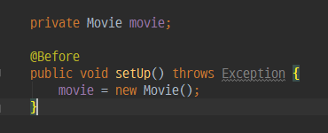

# TDD Example

[Test Driven Development: By Example](https://www.amazon.com/Test-Driven-Development-Kent-Beck/dp/0321146530)의 예제

사용자들은 영화에 평점을 부여할 수 있고(rate), 평점의 평균(getAverage)을 얻을 수 있다.
---
## 목차
- [두번_rate_되었을때_평균은_rate의_합을_count로_나눈값](#두번_rate_되었을때_평균은_rate의_합을_count로_나눈값)
- [Refactor](#Refactor)

---
## 목차
- [source directory 생성](#source-directory-생성)
- [Movie Class 생성 및 한번도 rate 되지않았을때 평균도 0 테스트](#Movie-Class-생성-및-한번도-rate-되지않았을때-평균도-0-테스트)
- [한번-rate-되었을때-평균은-rate와-같다 테스트](#한번-rate-되었을때-평균은-rate와-같다-테스트)

---

## 두번_rate_되었을때_평균은_rate의_합을_count로_나눈값

<<<<<<< HEAD

=======
```language
mkdir -p src/main/java
mkdir -p src/test/java
```

## Movie Class 생성 및 한번도 rate 되지않았을때 평균도 0 테스트
바로 Movie.java를 만들고 싶지만 TDD에서는 Movie.java를 만들 필요가 있게 개발하는 것이 포인트이다.
>>>>>>> branch-1

두번 ```rate```되었을 때는 ```rate```의 합을 ```count```로 나눈 값이므로 ```rateCount```라는 필드변수를 선언해주었고, ```rate```함수에서 ```rateCount```를 증가시켜주었습니다. 그리고 ```getAverage()```에서 ```rateCount```로 ```rated```를 나눈 값을 리턴하면 됩니다. 하지만 ```rateCount```초기값이 0이므로 0으로 나누는 경우가 생기기 때문에 별도로 처리해준 것을 볼 수 있습니다.

## Refactor

위의 사진에서 

<<<<<<< HEAD
```java
Movie movie = new Movie();
```
=======
## 한번 rate 되었을때 평균은 rate와 같다 테스트
>>>>>>> branch-1

코드가 반복되는 것을 줄여봅시다. 해당 코드를 ```before```로 따로 빼주면 아래와 같이 됩니다.



---
> 이 글은 [ 클린코더스 - 백명석님 ](https://www.youtube.com/user/codetemplate/videos) 강의를 보고 작성한 글입니다.
