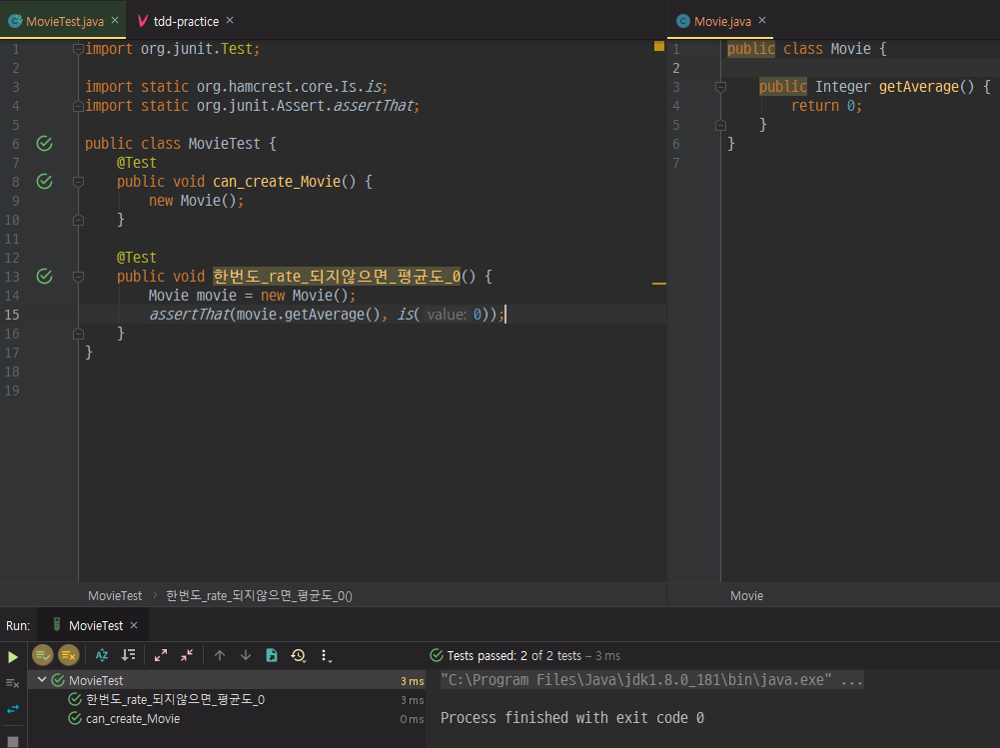
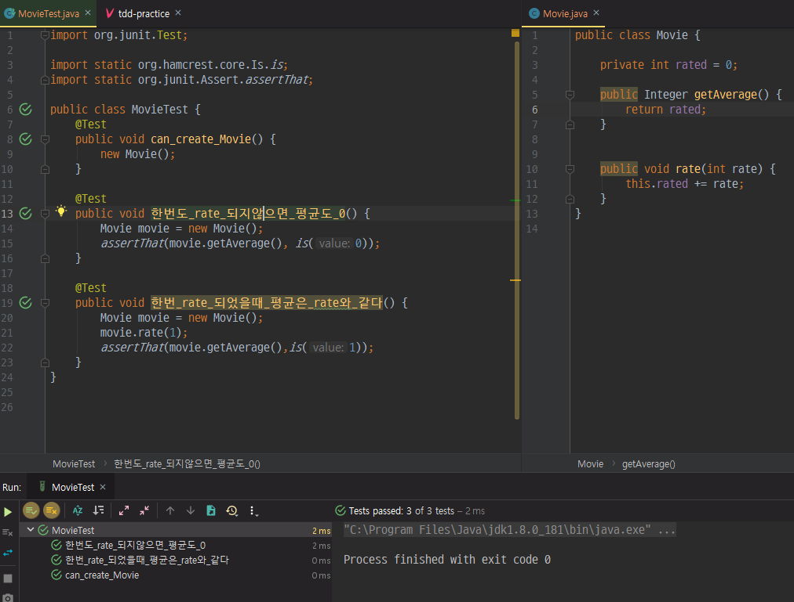

# TDD Example

[Test Driven Development: By Example](https://www.amazon.com/Test-Driven-Development-Kent-Beck/dp/0321146530)의 예제

사용자들은 영화에 평점을 부여할 수 있고(rate), 평점의 평균(getAverage)을 얻을 수 있다.


---

## source directory 생성

```language
mkdir -p src/main/java
mkdir -p src/test/java
```
## Movie Class 생성 및 한번도 rate 되지않았을때 평균도 0 테스트
바로 Movie.java를 만들고 싶지만 TDD에서는 Movie.java를 만들 필요가 있게 개발하는 것이 포인트이다.



```can_create_Movie()```테스트를 이용해서 ```Movie``` 객체를 생성할 수 있는지 없는지 확인한다. 이 테스트를 통과하기위해서 Movie클래스를 생성해준 것이다.

두번째 테스트로 ```한번도 rate 되지않았을때 평균도 0``` 이라는 테스트에서 한번도 rate되지않았다는 뜻은 객체생성 후 한번도 rate 되지않았다는 뜻이다.

## 한번_rate_되었을때_평균은_rate와_같다 테스트



```rate```를 구하기위해 ```rated```라는 필드변수를 생성해주고 ```rate```될 때마다 ```rated```에 그 값을 더해주고, ```getAverage```는 rated를 리턴한다.

---
> 이 글은 [ 클린코더스 - 백명석님 ](https://www.youtube.com/user/codetemplate/videos) 강의를 보고 작성한 글입니다.
