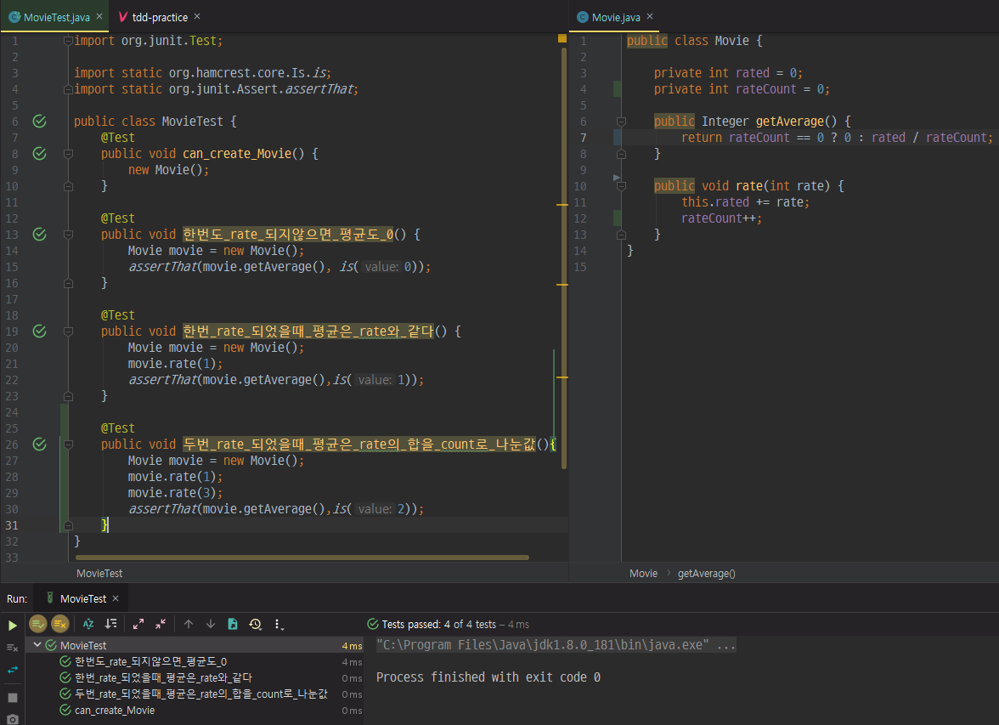

# TDD Example

[Test Driven Development: By Example](https://www.amazon.com/Test-Driven-Development-Kent-Beck/dp/0321146530)의 예제

사용자들은 영화에 평점을 부여할 수 있고(rate), 평점의 평균(getAverage)을 얻을 수 있다.

---
## 목차
- [source directory 생성](#source-directory-생성)
- [Movie Class 생성 및 한번도 rate 되지않았을때 평균도 0 테스트](#Movie-Class-생성-및-한번도-rate-되지않았을때-평균도-0-테스트)
- [한번-rate-되었을때-평균은-rate와-같다 테스트](#한번-rate-되었을때-평균은-rate와-같다-테스트)

---

<<<<<<< HEAD
## 목차
브랜치 별로 단계를 나누었고, TDD 진행 절차입니다.
=======
## 두번_rate_되었을때_평균은_rate의_합을_count로_나눈값

<<<<<<< HEAD

=======
```language
mkdir -p src/main/java
mkdir -p src/test/java
```

## Movie Class 생성 및 한번도 rate 되지않았을때 평균도 0 테스트
바로 Movie.java를 만들고 싶지만 TDD에서는 Movie.java를 만들 필요가 있게 개발하는 것이 포인트이다.
>>>>>>> branch-1

두번 ```rate```되었을 때는 ```rate```의 합을 ```count```로 나눈 값이므로 ```rateCount```라는 필드변수를 선언해주었고, ```rate```함수에서 ```rateCount```를 증가시켜주었습니다. 그리고 ```getAverage()```에서 ```rateCount```로 ```rated```를 나눈 값을 리턴하면 됩니다. 하지만 ```rateCount```초기값이 0이므로 0으로 나누는 경우가 생기기 때문에 별도로 처리해준 것을 볼 수 있습니다.

## Refactor
>>>>>>> branch-2

- [branch-1](https://github.com/GGomi/TDD_Practice/tree/branch-1)
- [branch-2](https://github.com/GGomi/TDD_Practice/tree/branch-2)

<<<<<<< HEAD
---
## 결과
=======
<<<<<<< HEAD
```java
Movie movie = new Movie();
```
=======
## 한번 rate 되었을때 평균은 rate와 같다 테스트
>>>>>>> branch-1
>>>>>>> branch-2

처음 접해본 TDD였는데 솔직히 아직은 쉬운 예제라서 큰 어려움은 없었습니다.
번거로울 수 있지만 당연히 해야하는 과정이라고 생각하니깐 번거롭다는 생각은 사라지게 되었고. 확실히 테스트케이스로 검증을 하고나서, 개발을 시작한다면 좀 더 믿음을 가지고 적극적으로 개발할 수 있었습니다.

큰 프로젝트에 이렇게 TDD로 진행되었다면 변경사항들이 생길 때 진짜 공격적으로 수정할 수 있을 것 같았다.

---
> 이 글은 [ 클린코더스 - 백명석님 ](https://www.youtube.com/user/codetemplate/videos) 강의를 보고 작성한 글입니다.
